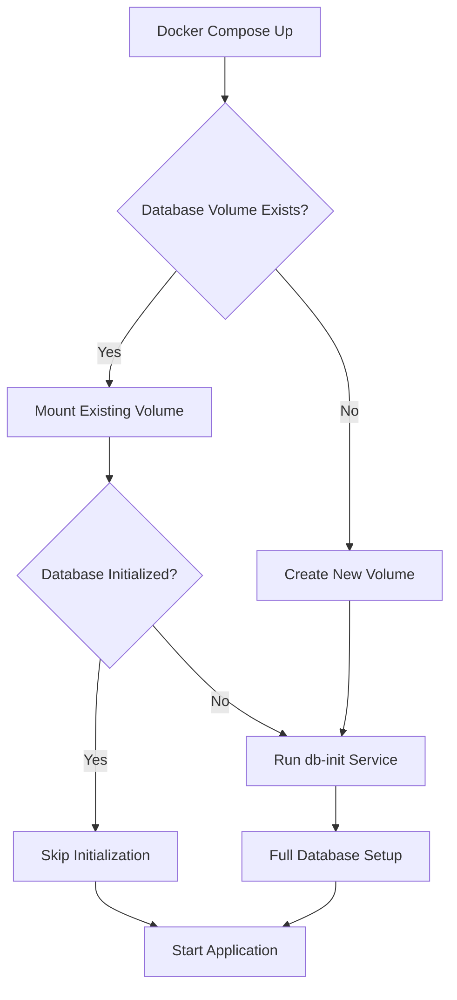

# Database Persistence Guide

This guide explains how database persistence works in the Telugu Corpus application and provides tools for managing the database lifecycle.

## 🎯 What Changed

### Database Persistence
- **PostgreSQL data is now fully persistent** across container restarts
- **Database initialization is smart** - it only runs when needed
- **No more data loss** when restarting Docker containers
- **Volume management** is now explicit and reliable

### Key Improvements
1. **Smart Initialization**: Database initialization checks if data already exists
2. **Persistent Volumes**: Explicit volume configuration ensures data persistence
3. **Database Management Tools**: New utilities for managing database state
4. **Restart Safety**: Containers can be safely restarted without data loss

## 🚀 Quick Start

### First Time Setup
```bash
# Start the application (will initialize database on first run)
docker-compose up -d

# Check initialization status
python manage_database.py status
```

### Subsequent Runs
```bash
# Start/restart application (will skip initialization if already done)
docker-compose up -d

# Database data persists automatically
```

## 🛠️ Database Management Tools

### Check Database Status
```bash
# Quick status check
python manage_database.py status

# Detailed information
python manage_database.py info
```

### Seed Sample Data
```bash
# Add test users and sample data for development
python manage_database.py seed
```

### Force Reinitialization (⚠️ Destructive)
```bash
# WARNING: This destroys all data!
python manage_database.py reinit
```

### Clean Docker Volumes (⚠️ Destructive)
```bash
# WARNING: This destroys all Docker volumes!
python manage_database.py clean
```

## 📊 How It Works

### Database Initialization Logic
1. **Check if initialized**: Looks for existing roles in the database
2. **Skip if ready**: If 3+ roles exist, skip initialization
3. **Initialize if needed**: Only runs full setup on fresh databases

### Volume Persistence
- **PostgreSQL data**: Stored in `postgres_data` Docker volume
- **Redis data**: Stored in `redis_data` Docker volume  
- **Celery beat**: Stored in `celery_beat_data` Docker volume

### Container Lifecycle


## 🔧 Configuration

### Docker Compose Changes
- Added `PGDATA` environment variable for PostgreSQL
- Added explicit volume drivers
- Enhanced health checks
- Improved restart policies

### Initialization Script Changes
- Added `is_database_initialized()` function
- Smart initialization logic
- Comprehensive status checking

## 📝 User Role Management

The role management script (`manage_user_roles.py`) works seamlessly with persistent data:

```bash
# List all users and their roles
python manage_user_roles.py list-users

# Add admin role to a user
python manage_user_roles.py assign-role user@example.com admin

# Find user by phone
python manage_user_roles.py find-user --phone 1234567890
```

## 🔍 Troubleshooting

### Database Won't Start
```bash
# Check PostgreSQL logs
docker-compose logs postgres

# Check initialization logs
docker-compose logs db-init
```

### Data Appears Lost
```bash
# Check if volumes exist
docker volume ls | grep corpus-te

# Check database status
python manage_database.py status
```

### Reset Everything
```bash
# Stop containers
docker-compose down

# Clean all volumes (WARNING: Destroys data!)
python manage_database.py clean

# Start fresh
docker-compose up -d
```

### Partial Initialization
```bash
# Force complete reinitialization
python manage_database.py reinit
```

## 📊 Database Schema Overview

### Core Tables
- **role**: System roles (admin, user, reviewer)
- **user**: User accounts with authentication
- **user_roles**: Many-to-many user-role associations
- **category**: Content categories
- **record**: Media submissions with PostGIS location data
- **otp**: OTP authentication records

### Data Relationships
```
User ←→ UserRoles ←→ Role
User → Record → Category
Record → PostGIS Location Data
```

## 🎯 Best Practices

### Development
1. **Use sample data**: Run `python manage_database.py seed` for test data
2. **Check status regularly**: Use `python manage_database.py status`
3. **Backup before major changes**: Export data before schema changes

### Production
1. **Regular backups**: Set up automated database backups
2. **Monitor volumes**: Ensure adequate disk space for volumes
3. **Health checks**: Monitor container health and database connectivity
4. **Access control**: Secure database access and credentials

### Data Management
1. **Role assignments**: Use `manage_user_roles.py` for user management
2. **Content management**: Use the API for record and category management
3. **System monitoring**: Regular status checks and log monitoring

## 🔐 Security Considerations

### Database Access
- Database credentials are environment-based
- PostgreSQL runs in isolated Docker network
- Volume access is container-restricted

### User Management
- Role-based access control (RBAC) enforced
- User authentication via phone/OTP
- Password hashing with secure algorithms

## 📈 Monitoring

### Health Checks
```bash
# Application health
curl http://localhost:8000/health

# Database connectivity
python manage_database.py status

# Container status
docker-compose ps
```

### Logs
```bash
# Application logs
docker-compose logs app

# Database logs
docker-compose logs postgres

# Worker logs
docker-compose logs celery-worker
```

## 🆘 Support

If you encounter issues:

1. **Check the logs**: `docker-compose logs [service-name]`
2. **Verify status**: `python manage_database.py status`
3. **Review configuration**: Ensure environment variables are set
4. **Check disk space**: Ensure adequate space for Docker volumes
5. **Restart services**: `docker-compose restart [service-name]`

For persistent issues, consider:
- Reviewing the Docker Compose configuration
- Checking PostgreSQL and PostGIS compatibility
- Verifying network connectivity between containers
- Examining volume mount permissions

## 📚 Related Documentation

- [PostgreSQL Setup Guide](docs/POSTGRESQL_SETUP.md)
- [User Role Management](manage_user_roles.py)
- [API Documentation](README.md)
- [Deployment Guide](docs/DEPLOYMENT_GUIDE.md)
